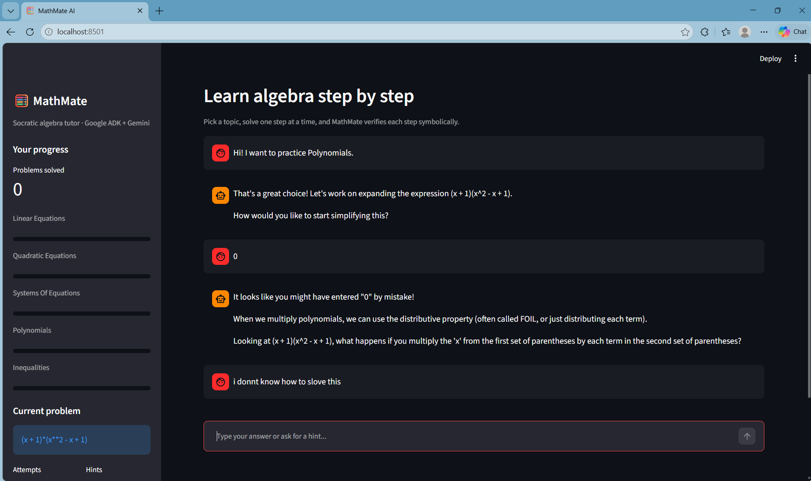
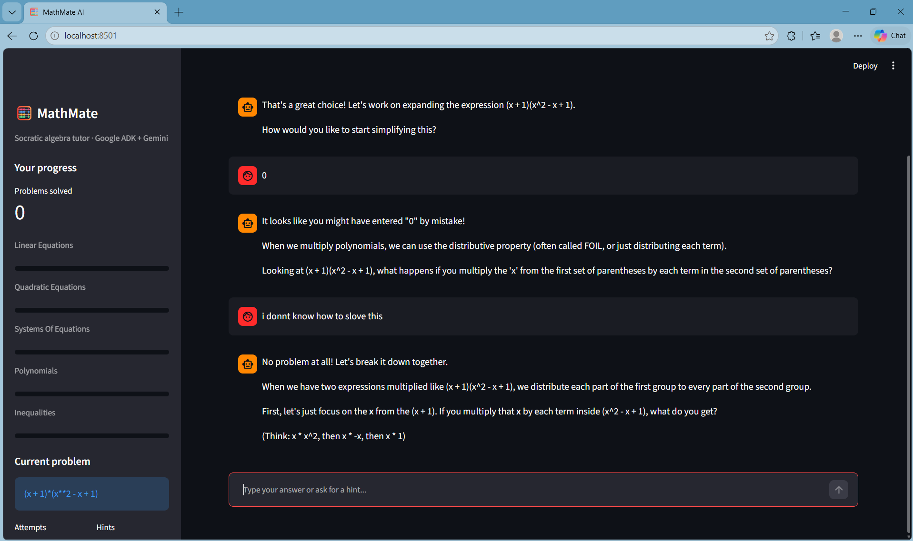
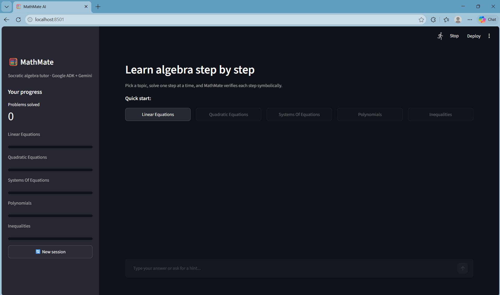
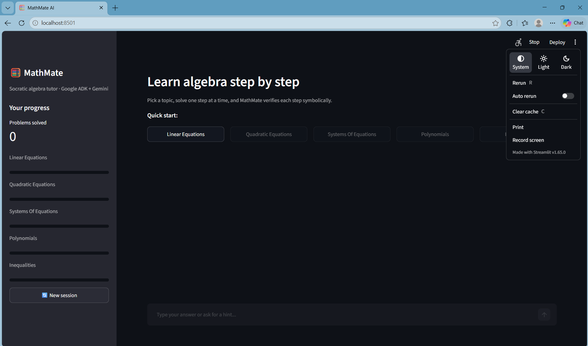
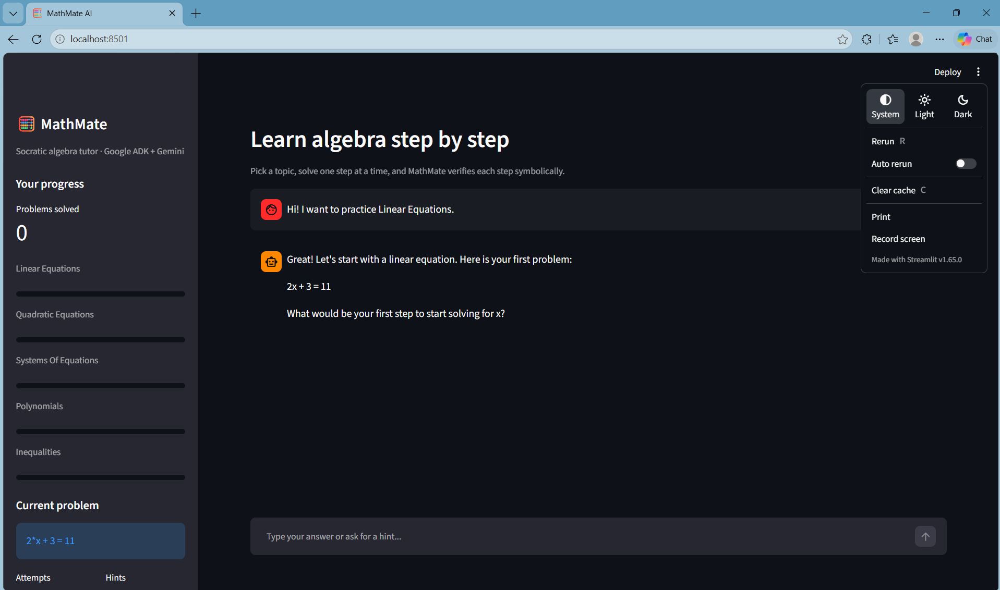
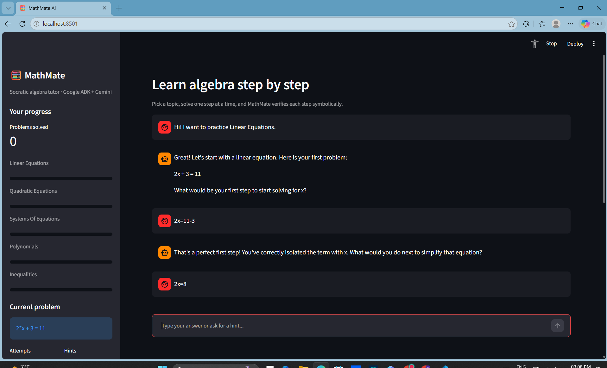
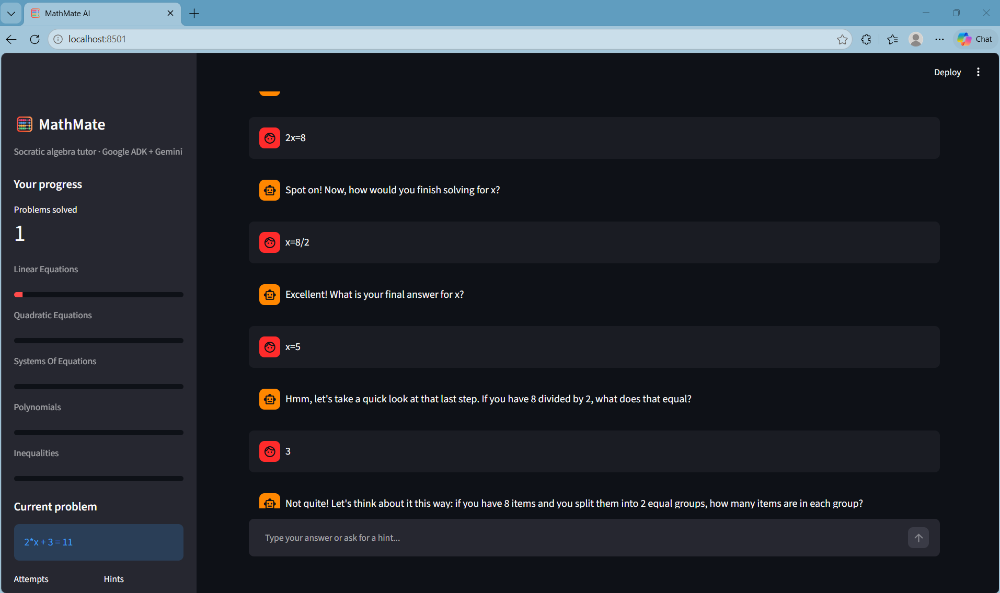
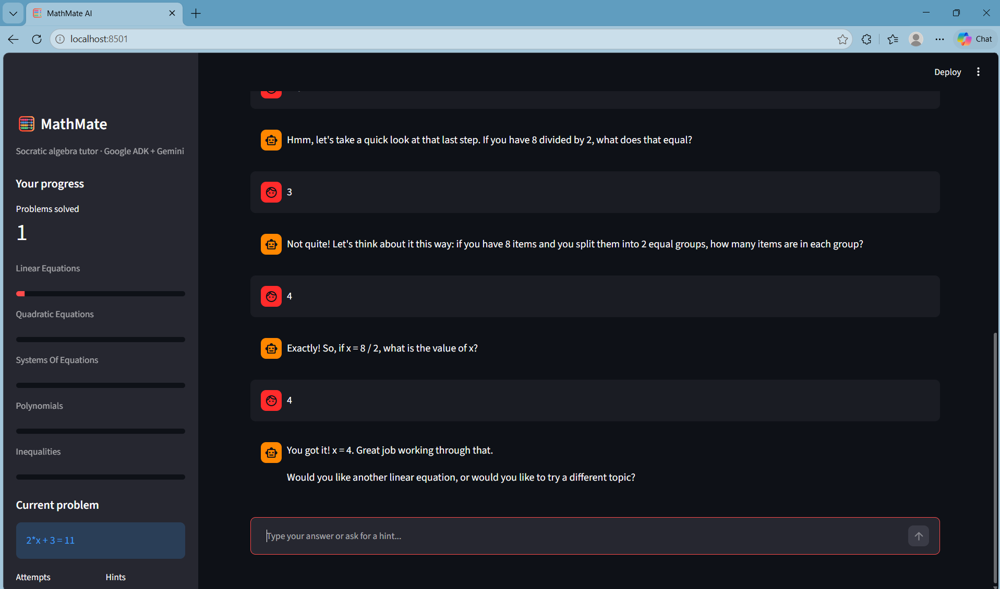

# MathMate AI — LLM-Powered Algebra Tutor Agent

An autonomous tutoring agent, built on **Google's Agent Development Kit
(ADK)**, that guides students through algebra problems step-by-step
using Socratic questioning, exact symbolic verification, and persistent
session-state so it stays context-aware across a multi-turn conversation.

> Maps directly to the project summary:
> *"Built an autonomous tutoring agent using Google's ADK to guide
> students through algebra problems step-by-step. Designed agent
> instructions and session-state management for context-aware,
> multi-turn tutoring conversations."*

**Model backend:** runs on **Gemini** natively via Google ADK.


## Demo (running locally)

Streamlit web UI: topic buttons, step-by-step tutoring chat, and a live progress sidebar.










---

## Why this design

Two things an LLM alone is bad at: (1) reliably knowing whether a
student's algebra step is actually correct, and (2) remembering exactly
where a student left off across many turns. MathMate solves both outside
the model:

- **Correctness** is delegated to `sympy` — every step the student
  proposes is checked by exact symbolic comparison, not by asking Gemini
  "is this right?" (see `mathmate/tools.py::check_algebra_step`).
- **Continuity** is delegated to ADK's session state — a small, explicit
  schema (`mathmate/state_schema.py`) tracks the current problem, step
  number, hints used, and per-topic mastery, and every tool reads/writes
  through it so nothing depends on the model "remembering" mid-context.

The LLM's job is narrower and more suited to what it's good at:
deciding *when* to introduce a new problem, *how* to phrase a hint, *when*
to escalate specificity, and *how* to keep the student motivated.

## Architecture

```
mathmate-ai/
├── mathmate/
│   ├── agent.py          # root_agent: Agent(model="gemini-3.1-flash-lite", ...)
│   ├── prompts.py         # Socratic tutoring instructions
│   ├── tools.py           # generate_practice_problem, check_algebra_step, update_mastery
│   └── state_schema.py    # session-state keys + default factory
├── app.py                  # Streamlit web app (chat UI + progress sidebar)
├── main.py                 # interactive CLI runner (Runner + InMemorySessionService)
├── tests/
│   └── test_tools.py       # unit tests for the deterministic tools (no API key needed)
├── examples/
│   └── sample_conversation.md
├── requirements.txt
└── .env.example
```

```
 Student turn
      │
      ▼
 ┌─────────────────────────────┐
 │  Runner (google.adk.runners) │  ← wires agent + session together
 └──────────────┬───────────────┘
                │
                ▼
 ┌─────────────────────────────┐        ┌───────────────────────────┐
 │  mathmate_tutor (Gemini 2.5  │──tool──▶  generate_practice_problem│
 │  Flash) + TUTOR_INSTRUCTION  │  calls │  check_algebra_step (sympy)│
 └──────────────┬───────────────┘        │  update_mastery            │
                │                        └─────────────┬──────────────┘
                ▼                                      │
        session.state  ◀─────────────────────────────┘
   (current_problem, current_step, hints_used,
    mastery per topic, problems_solved, history)
```

## Tools

| Tool | Purpose |
|---|---|
| `generate_practice_problem(topic, difficulty)` | Picks a problem from a curated bank per topic/difficulty, resets per-problem state. |
| `check_algebra_step(original, rewrite)` | Symbolically verifies whether the student's rewritten line is mathematically equivalent to the previous one (sympy). |
| `update_mastery(topic, solved_without_hints)` | Nudges a persistent 0–1 mastery score per topic and logs the event to session history. |

## Session state

| Key | What it tracks |
|---|---|
| `current_topic` / `current_problem` / `current_step` | The problem in progress. |
| `hints_used_this_problem` / `attempts_this_problem` | Per-problem counters, reset on each new problem. |
| `mastery` | `dict[topic → float 0..1]`, persists across problems to drive adaptive difficulty. |
| `problems_solved` / `session_history` | Longer-running session summary. |

## Setup

```bash
cd mathmate-ai
pip install -r requirements.txt
cp .env.example .env
# then edit .env and add your GOOGLE_API_KEY (free: https://aistudio.google.com/apikey)
```

## Run it

**Interactive CLI:**
```bash
streamlit run app.py   # web UI (or: python main.py for CLI)
```

**ADK's built-in dev UI** (if you have the `adk` CLI installed):
```bash
adk web
```

## Tests

The tools are pure Python + sympy, so they're fully testable without any
API key or network access:

```bash
pytest tests/ -v
```

## Extending this project

- **New topics**: add entries to `_PROBLEM_BANK` in `tools.py`.
- **Richer verification**: `check_algebra_step` currently handles single
  equations/expressions; extending it to check one line of a system of
  equations, or to verify factored vs. expanded polynomial forms, is a
  natural next step.
- **Persistence across sessions**: swap `InMemorySessionService` in
  `main.py` for ADK's database-backed session service to remember a
  student's mastery across days, not just one conversation.
- **Sub-agents**: a natural extension is splitting this into a
  `problem_selector` sub-agent and a `hint_generator` sub-agent under a
  coordinator, if the single-agent instruction set gets too complex.

## Notes on the ADK API surface

This project targets the documented `google-adk` Python package
(`Agent`, `Runner`, `InMemorySessionService`, `ToolContext`,
`before_agent_callback`). ADK has moved quickly since
release — if `pip install google-adk` gives you a different import path
than what's here, check the current docs at
https://google.github.io/adk-docs/ and adjust the few import lines in
`mathmate/agent.py` / `main.py` accordingly; the tutoring logic itself
(prompts, tools, state schema) doesn't depend on those specifics.

**Model**: set in one place -- `MODEL = "gemini-2.5-flash"` in `mathmate/agent.py`.